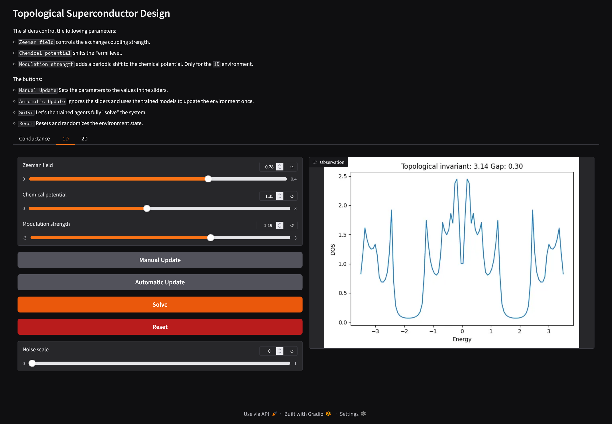

# Reinforcement learning an artificial topological superconductor

Proof of concept on how to drive tunable matter to a topological superconducting state



## Getting started

1. Clone the repo
```
git clone https://github.com/DualMono/rl-tsc.git && cd rl-tsc
```
2. Download and unzip the *dIdV* data (1.5 GB download, 4 GB on disk)
```
wget "https://zenodo.org/records/14732516/files/conductance_data.7z" -P utils/out/
7z e utils/out/conductance_data.7z -outils/out/
```
3. Install dependencies using [uv](https://github.com/astral-sh/uv) and activate the environment
```
uv sync
source .venv/bin/activate
```

### Training
Model training is done using the `train.py` script. It doesn't accept any CLI arguments, so parameters are controlled inside the file.
The top of the file includes 3 training scenarios with working parameters. The scenario is chosen right after the `__main__` clause.

Training logs can be viewed with TensorBoard using:
```
tensorboard --logdir logs
```

### Interactive webgui
The webgui can be used to visualize agent actions. It may also be used to play around with the different environments. To start the web interface, run:
```
python webgui.py
```

## Project structure
```
├── envs
│   └── RL environment implementations
├── logs
│   └── Training logs, split between the different environments
├── plots
│   └── Training result plots and physics illustrations
├── saves
│   └── Trained model checkpoints
└── utils
    └── Helper scripts to pre calculate simulations and parse the results
    └── out
        dIdV simulation results 
```